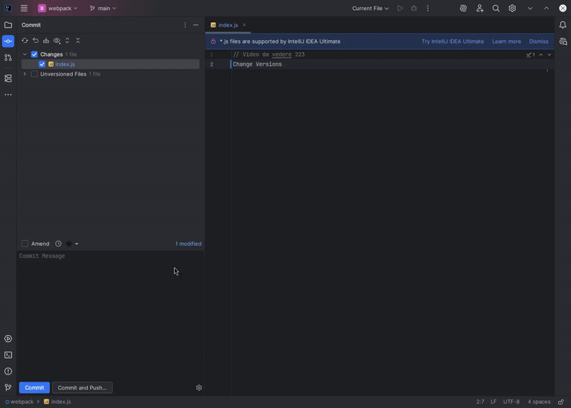

<!-- Plugin description -->

    

<h1 align="center">Commit AI</h1>

Commit AI for IntelliJ based IDEs/Android Studio.

 

- [Description](#description)
- [Features](#features)
- [Compatibility](#compatibility)
- [Install](#install)
- [Installation from zip](#installation-from-zip)

## Description

Commit AI is a plugin that generates your commit messages by using git diff and LLMs.

### ✨ Key Features
- **AI-powered commit messages**: Generate meaningful commit messages from your code changes
- **Multiple LLM providers**: Support for Groq and Pollinations with top models like Llama 3.3 70B
- **Smart diff analysis**: Analyzes only selected files and lines in the commit dialog
- **Amend mode support**: Generate commit messages for previous commits in amend mode
- **Custom prompts**: Create and customize your own prompt templates with variables
- **Universal IDE support**: Works across all JetBrains IDEs (IntelliJ, PhpStorm, PyCharm, WebStorm, etc.)
- **Git & SVN support**: Compatible with both Git and Subversion version control systems

### 🚀 Getting Started
Install the plugin and configure your LLM client in <kbd>Settings</kbd> > <kbd>Tools</kbd> > <kbd>Commit AI</kbd>

## Features

- Generate commit message from git diff using LLM
- Generate commit message for previous commit when in amend mode
- Compute diff only from the selected files and lines in the commit dialog
- Create your own prompt for commit message generation
- Use predefined variables and hint to customize your prompt
- Supports Git and Subversion as version control systems.

## Supported models

- Groq
- Pollinations

The plugin uses [langchain4j](https://github.com/langchain4j/langchain4j) for creating LLM API clients with OpenAI-compatible APIs. It currently supports Groq and Pollinations. If you would like support for additional LLM providers, please make a feature request in GitHub issues.

## Demo

<picture>
  <source media="(prefers-color-scheme: dark)" srcset="./assets/plugin-dark.gif">
  <source media="(prefers-color-scheme: light)" srcset="./assets/plugin-light.gif">
  
</picture>

## Compatibility

IntelliJ IDEA, PhpStorm, WebStorm, PyCharm, RubyMine, AppCode, CLion, GoLand, DataGrip, Rider, MPS, Android Studio,
DataSpell, Code With Me

## Install

Or you could install it inside your IDE:

For Windows & Linux: <kbd>File</kbd> > <kbd>Settings</kbd> > <kbd>Plugins</kbd> > <kbd>Marketplace</kbd> > <kbd>Search
for "Commit AI"</kbd> > <kbd>Install Plugin</kbd> > <kbd>Restart IntelliJ IDEA</kbd>

For Mac: <kbd>IntelliJ IDEA</kbd> > <kbd>Preferences</kbd> > <kbd>Plugins</kbd> > <kbd>Marketplace</kbd> > <kbd>Search
for "Commit AI"</kbd> > <kbd>Install Plugin</kbd>  > <kbd>Restart IntelliJ IDEA</kbd>

### Installation from zip

1. Download zip from [releases](https://github.com/FrancoStino/commit-ai-jetbrains-plugin/releases)
2. Import to IntelliJ: <kbd>Settings</kbd> > <kbd>Plugins</kbd> > <kbd>Install plugin from
   disk...</kbd>
3. Set LLM client configuration in plugin's settings: <kbd>Settings</kbd> > <kbd>Tools</kbd> > <kbd>Commit AI</kbd>

## Support

* [Star the repository](https://github.com/FrancoStino/commit-ai-jetbrains-plugin)
* [Rate the plugin](https://plugins.jetbrains.com/plugin/28558-commit-ai/)
* [Share the plugin](https://plugins.jetbrains.com/plugin/28558-commit-ai/)
* [Sponsor me](https://github.com/sponsors/FrancoStino)

## Contributing

Please see [CONTRIBUTING](CONTRIBUTING.md) for details.

## Acknowledgements

- [langchain4j](https://github.com/langchain4j/langchain4j) for LLM API clients.

## License

Please see [LICENSE](LICENSE.md) for details.

## Star History

<a href="https://www.star-history.com/#FrancoStino/commit-ai-jetbrains-plugin&Date">
 <picture>
   <source media="(prefers-color-scheme: dark)" srcset="https://api.star-history.com/svg?repos=FrancoStino/commit-ai-jetbrains-plugin&type=Date&theme=dark" />
   <source media="(prefers-color-scheme: light)" srcset="https://api.star-history.com/svg?repos=FrancoStino/commit-ai-jetbrains-plugin&type=Date" />
   
 </picture>
</a>
<!-- Plugin description end -->
